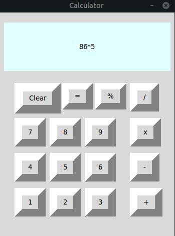

# Simple-Calculator - Calculation of two numbers only

## Introduction
A simple calculator made with Tkinter that takes only two numbers
The project was made for practice purposes

## Technologies
- Python 3.8.10
- Tkinter 8.6.10

## Setup
```
$ sudo apt install python3.8
$ python3.8
```
## Screenshot

